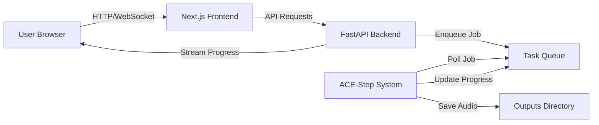

# Modern Web App Migration Plan for ACE-Step

## 1. Executive Summary
To address the limitations of the current Gradio interface—specifically the lack of robust failure monitoring, granular progress feedback, and modern UI/UX—we propose migrating to a decoupled client-server architecture. This will enable advanced error handling, real-time status streaming, and a premium "Text-to-Music" studio experience.

## 2. Component Analysis & Migration Strategy

We have analyzed the existing Gradio application (`acestep/ui/components.py`) and established the following mapping for the new architecture:

| Gradio Component | Purpose | New UX Implementation |
| :--- | :--- | :--- |
| **Global Param Loader** | Loads JSON history | **Project Sidebar**: Specific "History" tab with rich cards (Audio Preview + Metadata) and "Remix" button. |
| **Text2Music Tab** | Main generation interface | **Studio Canvas**: Large central waveform visualizer with a collapsable "Generation Panel" on the right. |
| **Output Audio** | Simple HTML5 player | **Waveform Visualizer**: (`wavesurfer.js`) Interactive, allowing drag-to-select for repainting regions. |
| **Retake Tab** | Variations of previous track | **Variant Tree**: Instead of a separate tab, view "Alternative Takes" nested under the original track in the History. |
| **Repainting Tab** | In-painting time segments | **Direct Manipulation**: Drag a box on the main visualizer timeline to define start/end points, then click "Repaint Region". |
| **Extend Tab** | Out-painting (intro/outro) | **Timeline Editor**: "Add Block" buttons before/after the waveform to visually expand the canvas. |
| **Logs/Status** | Hidden terminal output | **Console Drawer**: A bottom-sheet console that streams real-time backend logs (stdout/stderr) via WebSockets. |

## 3. Technology Stack

### Backend (API & Model Server)
*   **Framework**: **FastAPI** (Python).
    *   *Why*: High performance, native support for async (concurrency), and easy integration with the existing PyTorch/ACE-Step codebase.
*   **Task Queue**: **Redis Queue (RQ)** or **Celery**.
    *   *Why*: Decouples the long-running generation task (music synthesis) from the HTTP request. Prevents timeout issues and allows for job status polling/cancellation.
*   **Protocol**: **WebSockets** (for real-time progress bars and log usage).

### Frontend (User Interface)
*   **Framework**: **Next.js** (React) with TypeScript.
    *   *Why*: Industry standard for modern web apps, robust state management, and component reusability.
*   **Styling**: **Tailwind CSS**.
    *   *Why*: Rapid development of "Rich Aesthetic" designs (glassmorphism, animations) as requested.
*   **State Management**: **Zustand** or **TanStack Query**.
    *   *Why*: To handle the complex state of generation parameters (prompts, seeds, audio inputs) and server sync.

## 3. Architecture Overview

## 4. Key Features & Improvements

### A. Advanced Failure Monitoring & Reporting
*   **Real-time Log Stream**: The UI will have a collateral "Console/Logs" drawer that streams backend stdout/stderr in real-time via WebSockets.
*   **Validation Layer**: Frontend will validate inputs (e.g., prompt length, file formats) before sending.
*   **Health Checks**: The app will periodically check GPU health (VRAM usage) and disk space, warning the user *before* a crash occurs.
*   **Structured Error Responses**: Instead of silent failures, the API will return precise error codes (e.g., `MODEL_LOAD_ERROR`, `AUDIO_SAVE_FAILED`) which the UI triggers into specific help modals.

### B. Modern UI/UX implementation
*   **Visualizer**: Replace standard HTML5 audio players with waveform visualizations (using `wavesurfer.js`) that show the audio structure.
*   **Interactive History**: A proper "Gallery" sidebar instead of a simple dropdown, verifying file existence and showing metadata previews.
*   **Non-blocking Interface**: You can browse parameters or previous generations while a new one is processing in the background.

## 5. Development Roadmap (Status: ✅ Active Beta)

### Phase 1: API Foundation (Backend) - ✅ COMPLETED
1.  [x] Set up FastAPI project structure in `acestep/api`.
2.  [x] Wrap `ACEStepPipeline` in a singleton dependency.
3.  [x] Create endpoints: `/generate`, `/status/{job_id}`, `/history`, `/outputs`.
4.  [x] Implement `soundfile` saving logic for reliability.
5.  [x] **Optimization**: Implemented `cpu_offload` to support 8GB VRAM GPUs.

### Phase 2: Frontend Skeleton (Frontend) - ✅ COMPLETED
1.  [x] Initialize Next.js project.
2.  [x] Implement "Rich Aesthetics" design system (Dark Mode Studio).
3.  [x] Build the "Studio" layout (Sidebar, Control Panel, Console Drawer).

### Phase 3: Integration & Monitoring - ✅ COMPLETED
1.  [x] Connect Frontend to API (CORS, Proxy).
2.  [x] Implement Polling-based progress tracking (Alternative to WebSocket).
3.  [x] **Console Drawer**: Real-time visualization of backend logs/status.
4.  [x] **Audio Playback**: Waveform visualization and playback of generated files.

### Phase 4: Advanced Features (Todo)
1.  [ ] **Retake**: Implement variation generation logic.
2.  [ ] **Repaint**: Add region selection tools to WaveformVisualizer.
3.  [ ] **Extend**: Add out-painting controls.

## 6. Current Status
The Studio is currently **Live and Functional**.
- **Backend**: Running on `http://localhost:8000`.
- **Frontend**: Running on `http://localhost:7865`.
- **Features**: Basic T2M generation, 8GB GPU optimization, Real-time monitoring, Playback.

